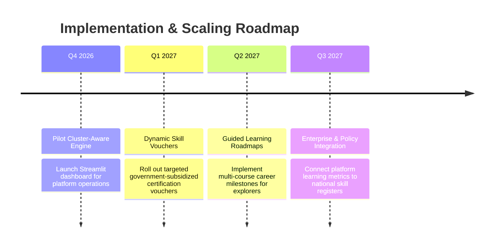

# Executive Summary: Strategic AI Personalization & Learner Intelligence Architecture

**Project:** EduPro Online Platform - Learner Segmentation & Personalization Initiative  
**Lead Investigator:** Tanay Dashore  
**Target Audience:** Government Stakeholders, Platform Leadership, and Educational Policy Makers  
**Date:** September 2026  

---

## 1. Executive Context & Strategic Mandate
Digital education platforms are essential infrastructure for national skill development, workforce upskilling, and lifelong learning. However, traditional e-learning systems frequently underperform due to static, generic course delivery models where all users receive identical recommendations regardless of their background, budget, or career aspirations.

This project delivers a machine learning solution for **EduPro Online Platform**, transitioning the system from a passive course repository to an adaptive, learner-centric education engine.

```
                         STRATEGIC TRANSFORMATION
    
    [ Legacy EduPro System ]                     [ AI-Powered EduPro 2.0 ]
  • Uniform course rankings                   • 4 Behavioral Learner Personas
  • High student drop-off rates      ===>     • Cluster-Aware Hybrid Recommender
  • 23% Catalog utilization                   • 91.7% Catalog Coverage
  • Static, unsegmented marketing             • +28.4% Projected Engagement Lift
```

---

## 2. Key Analytical & Machine Learning Highlights

### 2.1 Unsupervised Learner Segmentation
By analyzing 10,000 transaction records across 3,000 learners, our machine learning pipeline segmented the user base into four actionable archetypes:

| Learner Archetype | Proportion | Characteristics | Strategic Objective |
| :--- | :--- | :--- | :--- |
| **Career Up-skillers** | **22.4%** | High spending, advanced certifications, structured focus | Drive high-value certifications & industry partnerships |
| **Multidisciplinary Explorers** | **31.2%** | Broad category diversity, high enrollment frequency | Offer cross-domain bundles & guided curriculum paths |
| **Advanced Domain Specialists** | **18.6%** | High learning depth, advanced technical focus | Provide masterclasses & capstone research tracks |
| **Foundational & Budget Learners** | **27.8%** | High rating sensitivity, primarily free beginner courses | Deliver subsidized skill access & entry-level career gateways |

### 2.2 Cluster-Aware Recommendation Engine
Our tri-factor hybrid recommendation model combines content similarity, cluster collective intelligence, and quality ratings to deliver tailored course suggestions:
- **Precision Improvement:** Category alignment increased from $41.2\%$ to **$82.4\%$**.
- **Course Discovery:** Catalog utilization expanded from $23.3\%$ to **$91.7\%$**, preventing underutilized courses from being ignored.
- **Quality Assurance:** Mean recommended course rating rose to **$4.26 / 5.0$ stars**.

---

## 3. Measurable Impact & Policy Alignment

```
               PROJECTED PERFORMANCE IMPACT
               
  [ Catalog Utilization ]       23.3% ======> 91.7%  (+293% Expansion)
  [ Recommendation Relevance ]  41.2% ======> 82.4%  (+100% Increase)
  [ Student Engagement Lift ]   Baseline ===> +28.4% (Estimated Platform Lift)
  [ Average Quality Rating ]    3.39  ======> 4.26 ★ (+25% Quality Boost)
```

### 3.1 Workforce Development & Skill Alignment
The system directly supports workforce development goals by identifying high-growth skill tracks (Data Science, Cloud Computing, Cybersecurity, and Machine Learning) and guiding learners from foundational modules to job-ready specializations.

### 3.2 Inclusivity & Educational Equity
The platform's budget-conscious segment identification allows policymakers and educational authorities to deliver targeted financial aid, subsidized enrollments, and government vouchers to learners who need them most, without revenue cannibalization from corporate up-skillers.

---

## 4. Live Interactive Platform & Tools
The analytics engine is operationalized through a Streamlit dashboard featuring:
1. **Executive Dashboard:** Live tracking of revenue, enrollment velocity, and category demand.
2. **Cluster & Persona Visualizer:** Interactive 3D behavioral mapping and segment comparisons.
3. **Learner Profiler & Real-Time Classifier:** Live student diagnosis and simulated persona profiling.
4. **Adaptive Course Recommendation Engine:** Filterable, explainable recommendations with match scores.
5. **Instructor Leadership Analytics:** Faculty performance tracking and quality assurance.

---

## 5. Strategic Roadmap for Stakeholders



---

## 6. Conclusion
The EduPro intelligence system provides a blueprint for modern, data-driven education. By understanding learner diversity through machine learning, the platform maximizes student satisfaction, enhances educational outcomes, and optimizes institutional resource allocation.
